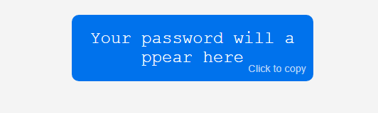

# Random Password Generator

This project is a simple and intuitive **Random Password Generator** built with HTML, CSS, and JavaScript. It allows users to create secure passwords based on customizable criteria such as length, inclusion of uppercase letters, lowercase letters, numbers, and special symbols.

## Features

- **Dynamic Password Length**: Users can specify the desired length of the password.
- **Customizable Criteria**: Options to include uppercase letters, lowercase letters, numbers, and special symbols.
- **Instant Generation**: Passwords are generated instantly with a click of a button.
- **Copy to Clipboard**: Users can easily copy the generated password to the clipboard with a single click.
- **Responsive Design**: The UI is responsive and looks great on any device.
- **Footer Credit**: Includes a footer with credit and a link to the developer's portfolio.

## How to Use

1. **Clone or download the repository:**
    ```bash
    git clone https://github.com/your-username/random-password-generator.git
    ```

2. **Open `index.html` in your favorite web browser.**

3. **Customize the password criteria** by checking the desired options.

4. **Set the password length** in the input field.

5. **Click "Generate"** to create your password.

6. **Click on the generated password card** to copy it to your clipboard.

## Technologies Used

- **HTML5**
- **CSS3**
- **JavaScript**

## Live Demo

[View Demo](https://your-demo-url.com) *(Include a link if you have a live demo available)*

## Author

- Developed by [Anandu B Kurup]([https://your-portfolio-url.com](https://bfrevren.netlify.app/))

## License

This project is licensed under the [MIT License](LICENSE).

---

### Example Screenshots

**Password Generator Interface:**

)

**Generated Password Card:**


 

---

### Contribution

Feel free to fork the repository and submit pull requests for any improvements or bug fixes. 

**Issues:** If you encounter any issues, please [open an issue](https://github.com/your-username/random-password-generator/issues).
